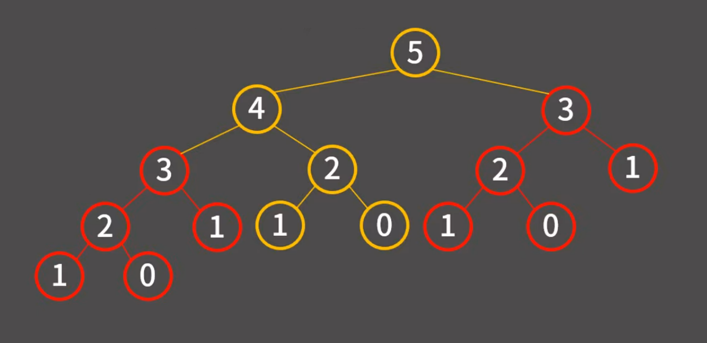

# 재귀

: 하나의 함수에서 자기 자신을 다시 호출해 작업을 수행하는 알고리즘

## Base condition

특정 입력에 대해서는 자기 자신을 호출하지 않고 종료되어야 한다.

모든 입력은 base condition 으로 수렴해야한다.

```js
function func1(num) {
    if (num === 0) return;
    console.log(`${num} `);
    func1(num - 1);
}
```

<br>

## 재귀에 대한 정보

1. 함수의 인자로 어떤 것을 받고 어디까지 계산한 후 자기 자신에게 넘겨줄지 명확하게 정할것.
2. 모든 재귀 함수는 **반복문만으로 동일한 동작**을 하는 함수를 만들 수 있다.
3. 재귀는 반복문으로 구현했을때 **코드 간결** BUT **메모리/시간 손해**
4. 한 함수가 **자기 자신을 여러번 호출하게 되면 비율적**일수 있다.
    ```js
    function fibo(num) {
        if (n <= 1) return 1;
        return fibo(num - 1) + fibo(n - 2);
    }
    ```
    
5. 재귀함수가 **자기 자신을 부를 때 스택 영역에 계속 누적**된다.
